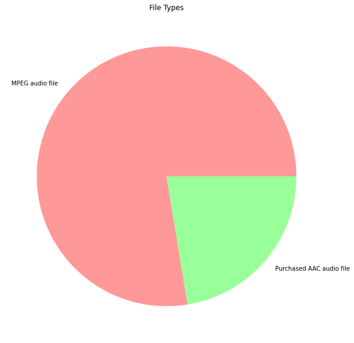
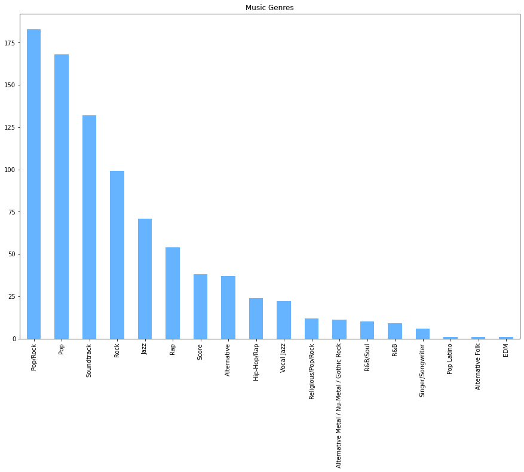
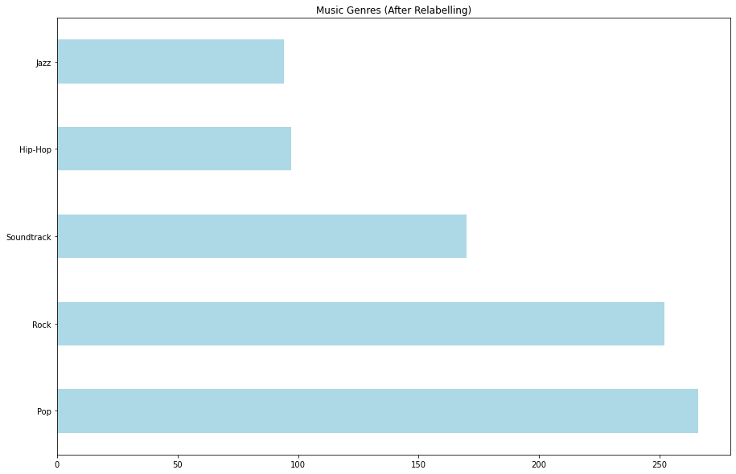

# Exploratory Data Analysis (Personal Music Collection Metadata)

### Load The Metadata


```python
import pandas as pd
import matplotlib.pyplot as plt

my_music_metadata_df = pd.read_csv("my_music_metadata.csv")
display(my_music_metadata_df)
```


<div>

<table border="1" class="dataframe">
  <thead>
    <tr style="text-align: right;">
      <th></th>
      <th>Track ID</th>
      <th>Name</th>
      <th>Artist</th>
      <th>Album</th>
      <th>Genre</th>
      <th>Location</th>
      <th>Kind</th>
      <th>Size</th>
      <th>Total Time</th>
    </tr>
  </thead>
  <tbody>
    <tr>
      <th>0</th>
      <td>212</td>
      <td>Over Overthinking You</td>
      <td>Christina Grimmie</td>
      <td>With Love</td>
      <td>Pop</td>
      <td>file:///Users/AlwynLopez/Music/iTunes/iTunes%2...</td>
      <td>MPEG audio file</td>
      <td>7438232</td>
      <td>183457</td>
    </tr>
    <tr>
      <th>1</th>
      <td>214</td>
      <td>Absolutely Final Goodbye</td>
      <td>Christina Grimmie</td>
      <td>With Love</td>
      <td>Pop</td>
      <td>file:///Users/AlwynLopez/Music/iTunes/iTunes%2...</td>
      <td>MPEG audio file</td>
      <td>6532311</td>
      <td>160809</td>
    </tr>
    <tr>
      <th>2</th>
      <td>216</td>
      <td>Make It Work</td>
      <td>Christina Grimmie</td>
      <td>With Love</td>
      <td>Pop</td>
      <td>file:///Users/AlwynLopez/Music/iTunes/iTunes%2...</td>
      <td>MPEG audio file</td>
      <td>9333659</td>
      <td>230844</td>
    </tr>
    <tr>
      <th>3</th>
      <td>218</td>
      <td>Get Yourself Together</td>
      <td>Christina Grimmie</td>
      <td>With Love</td>
      <td>Pop</td>
      <td>file:///Users/AlwynLopez/Music/iTunes/iTunes%2...</td>
      <td>MPEG audio file</td>
      <td>8606428</td>
      <td>212662</td>
    </tr>
    <tr>
      <th>4</th>
      <td>220</td>
      <td>With Love</td>
      <td>Christina Grimmie</td>
      <td>With Love</td>
      <td>Pop</td>
      <td>file:///Users/AlwynLopez/Music/iTunes/iTunes%2...</td>
      <td>MPEG audio file</td>
      <td>9618910</td>
      <td>237975</td>
    </tr>
    <tr>
      <th>...</th>
      <td>...</td>
      <td>...</td>
      <td>...</td>
      <td>...</td>
      <td>...</td>
      <td>...</td>
      <td>...</td>
      <td>...</td>
      <td>...</td>
    </tr>
    <tr>
      <th>874</th>
      <td>1962</td>
      <td>Anthems for a Seventeen Year Old Girl</td>
      <td>Broken Social Scene</td>
      <td>Scott Pilgrim Vs. the World</td>
      <td>Rock</td>
      <td>file:///Users/AlwynLopez/Music/iTunes/iTunes%2...</td>
      <td>MPEG audio file</td>
      <td>8899716</td>
      <td>275670</td>
    </tr>
    <tr>
      <th>875</th>
      <td>1964</td>
      <td>Scott Pilgrim</td>
      <td>Plumtree</td>
      <td>Scott Pilgrim Vs. the World</td>
      <td>Rock</td>
      <td>file:///Users/AlwynLopez/Music/iTunes/iTunes%2...</td>
      <td>MPEG audio file</td>
      <td>5889314</td>
      <td>181968</td>
    </tr>
    <tr>
      <th>876</th>
      <td>1966</td>
      <td>O Katrina!</td>
      <td>Black Lips</td>
      <td>Scott Pilgrim Vs. the World</td>
      <td>Rock</td>
      <td>file:///Users/AlwynLopez/Music/iTunes/iTunes%2...</td>
      <td>MPEG audio file</td>
      <td>5532348</td>
      <td>170840</td>
    </tr>
    <tr>
      <th>877</th>
      <td>1968</td>
      <td>Sleazy Bed Track</td>
      <td>The Bluetones</td>
      <td>Scott Pilgrim Vs. the World</td>
      <td>Rock</td>
      <td>file:///Users/AlwynLopez/Music/iTunes/iTunes%2...</td>
      <td>MPEG audio file</td>
      <td>8903857</td>
      <td>275800</td>
    </tr>
    <tr>
      <th>878</th>
      <td>1970</td>
      <td>By Your Side</td>
      <td>Beachwood Sparks</td>
      <td>Scott Pilgrim Vs. the World</td>
      <td>Rock</td>
      <td>file:///Users/AlwynLopez/Music/iTunes/iTunes%2...</td>
      <td>MPEG audio file</td>
      <td>9578567</td>
      <td>296829</td>
    </tr>
  </tbody>
</table>
<p>879 rows × 9 columns</p>
</div>


### Print Out Total File Size Storage And Total Time


```python
total_bytes = my_music_metadata_df['Size'].sum()
total_milliseconds = my_music_metadata_df['Total Time'].sum()

print("Total Bytes: \t", total_bytes)
print("Total Seconds: \t", total_milliseconds)
```

    Total Bytes: 	 6265166905
    Total Seconds: 	 175916573


That is about 6.26 gigabytes of data, and its duration is about 2 days.

### Pie Chart For File Types In My Music Collection


```python
file_type_counter = my_music_metadata_df['Kind'].value_counts()
file_type_counter.plot(
    kind='pie',
    figsize=(15,10),
    colors=['#ff9999','#99ff99'],
    title='File Types',
    ylabel=""
)
plt.show()
print(file_type_counter)
```





    MPEG audio file             682
    Purchased AAC audio file    197
    Name: Kind, dtype: int64


### Bar Chart For Music Genres In My Music Collection


```python
music_genre_counter = my_music_metadata_df['Genre'].value_counts()
music_genre_counter.plot(
    kind='bar',
    figsize=(15,10),
    color=['#66b3ff'],
    title='Music Genres'
)
plt.show()
```





As you can see on the above bar graph, there are over 18 genres in my personal music collection. To simplify the machine learning process, we need to reclassify each of the songs into one of five genres:
 * Soundtrack
 * Hip Hop
 * Jazz
 * Pop
 * Rock

To do that, lets examine the songs that are do not belong in one of the five categories.

# Data Cleaning

Here is a list of helper methods that aid in the data cleaning process.


```python
#filter tracks by genre
def filter_tracks_by_genre(genre):
    genre_conditional = my_music_metadata_df['Genre'] == genre
    songs_by_genre = my_music_metadata_df[genre_conditional]

    return songs_by_genre

#filter tracks by album name
def filter_tracks_by_album(album):
    album_conditional = my_music_metadata_df['Album'] == album
    songs_by_album = my_music_metadata_df[album_conditional]

    return songs_by_album

#Once filter tracks by genre, get me the list of albums
def get_albums_by_genre(genre):
    songs_by_genre = filter_tracks_by_genre(genre)
    album_list = list(songs_by_genre['Album'].unique())

    return album_list

#Once filter tracks by album, get me the list of artists
def get_artists_by_album(album):
    songs_by_genre = filter_tracks_by_album(album)
    artist_list = list(songs_by_genre['Artist'].unique())

    return artist_list

#Once filter tracks by genre, get me a list of albums along with their associated artists
def display_album_artist_by_genre(genre):
    albums = get_albums_by_genre(genre)
    print('List Of Albums Labeled As '+ genre +' Along With Associated Artists: ')
    for album in albums:
        print("**", album)
        artist_list = get_artists_by_album(album)
        for i, artist in enumerate(artist_list):
            print("  ", i + 1, "-", artist)

#Relabel all tracks in the album to its new genre
def relabel_album_genre(album, new_genre):
    album_conditional = my_music_metadata_df['Album'] == album
    my_music_metadata_df.loc[album_conditional, 'Genre'] = new_genre

```

## Pop Rock


```python
tracks = filter_tracks_by_genre('Pop/Rock')
tracks.sample(4)
```


<div>

<table border="1" class="dataframe">
  <thead>
    <tr style="text-align: right;">
      <th></th>
      <th>Track ID</th>
      <th>Name</th>
      <th>Artist</th>
      <th>Album</th>
      <th>Genre</th>
      <th>Location</th>
      <th>Kind</th>
      <th>Size</th>
      <th>Total Time</th>
    </tr>
  </thead>
  <tbody>
    <tr>
      <th>356</th>
      <td>924</td>
      <td>Golden Days</td>
      <td>Panic! At the Disco</td>
      <td>Death of a Bachelor</td>
      <td>Pop/Rock</td>
      <td>file:///Users/AlwynLopez/Music/iTunes/iTunes%2...</td>
      <td>MPEG audio file</td>
      <td>8241681</td>
      <td>254432</td>
    </tr>
    <tr>
      <th>355</th>
      <td>922</td>
      <td>LA Devotee</td>
      <td>Panic! At the Disco</td>
      <td>Death of a Bachelor</td>
      <td>Pop/Rock</td>
      <td>file:///Users/AlwynLopez/Music/iTunes/iTunes%2...</td>
      <td>MPEG audio file</td>
      <td>6383335</td>
      <td>196649</td>
    </tr>
    <tr>
      <th>422</th>
      <td>1056</td>
      <td>In Between</td>
      <td>Linkin Park</td>
      <td>Minutes to Midnight</td>
      <td>Pop/Rock</td>
      <td>file:///Users/AlwynLopez/Music/iTunes/iTunes%2...</td>
      <td>MPEG audio file</td>
      <td>4326761</td>
      <td>196806</td>
    </tr>
    <tr>
      <th>424</th>
      <td>1060</td>
      <td>The Little Things Give You Away</td>
      <td>Linkin Park</td>
      <td>Minutes to Midnight</td>
      <td>Pop/Rock</td>
      <td>file:///Users/AlwynLopez/Music/iTunes/iTunes%2...</td>
      <td>MPEG audio file</td>
      <td>9830791</td>
      <td>383555</td>
    </tr>
  </tbody>
</table>
</div>


```python
display_album_artist_by_genre("Pop/Rock")
```

    List Of Albums Labeled As Pop/Rock Along With Associated Artists:
    ** Back to Basics
       1 - Christina Aguilera
    ** American Idiot
       1 - Green Day
    ** ÷
       1 - Ed Sheeran
    ** Infinity on High
       1 - Fall Out Boy
       2 - Fall Out Boy & Butch Walker
    ** Death of a Bachelor
       1 - Panic! At the Disco
    ** Stripped
       1 - Christina Aguilera
       2 - Christina Aguilera & Lil' Kim
       3 - Christina Aguilera & Larry Gold
       4 - Christina Aguilera & Redman
    ** Songs About Jane
       1 - Maroon 5
    ** Absolute Greatest
       1 - Queen
       2 - Queen/David Bowie
       3 - Queen/National Philharmonic Orchestra
    ** Minutes to Midnight
       1 - Linkin Park
    ** Mezmerize
       1 - System of a Down
    ** Hypnotize
       1 - System of a Down
    ** Intertwined - EP
       1 - dodie
    ** Folie à Deux
       1 - Fall Out Boy


For the tracks that fall into one of the following albums:
 * Back to Basics
 * ÷
 * Stripped
 * Intertwined - EP,

All tracks that lie in the above albums, they will be labeled as "Pop" music. For the rest of the tracks that are not in the above albums, they will be labeled as "Rock" music.


```python
pop_albums = [
    'Back to Basics ',
    '÷',
    'Stripped',
    'Intertwined - EP'
]

pop_rock_albums = get_albums_by_genre('Pop/Rock')
for album in pop_rock_albums:
    if album in pop_albums:
        relabel_album_genre(album, "Pop")
    else:
        relabel_album_genre(album, "Rock")
```

## Rap


```python
tracks = filter_tracks_by_genre('Rap')
tracks.sample(4)
```


<div>

<table border="1" class="dataframe">
  <thead>
    <tr style="text-align: right;">
      <th></th>
      <th>Track ID</th>
      <th>Name</th>
      <th>Artist</th>
      <th>Album</th>
      <th>Genre</th>
      <th>Location</th>
      <th>Kind</th>
      <th>Size</th>
      <th>Total Time</th>
    </tr>
  </thead>
  <tbody>
    <tr>
      <th>810</th>
      <td>1834</td>
      <td>'97 Bonnie &amp; Clyde</td>
      <td>Eminem</td>
      <td>The Slim Shady LP</td>
      <td>Rap</td>
      <td>file:///Users/AlwynLopez/Music/iTunes/iTunes%2...</td>
      <td>MPEG audio file</td>
      <td>12730229</td>
      <td>316421</td>
    </tr>
    <tr>
      <th>774</th>
      <td>1762</td>
      <td>Drips</td>
      <td>Eminem/Obie Trice</td>
      <td>The Eminem Show</td>
      <td>Rap</td>
      <td>file:///Users/AlwynLopez/Music/iTunes/iTunes%2...</td>
      <td>MPEG audio file</td>
      <td>4612949</td>
      <td>285675</td>
    </tr>
    <tr>
      <th>806</th>
      <td>1826</td>
      <td>I'm Shady</td>
      <td>Eminem</td>
      <td>The Slim Shady LP</td>
      <td>Rap</td>
      <td>file:///Users/AlwynLopez/Music/iTunes/iTunes%2...</td>
      <td>MPEG audio file</td>
      <td>8550628</td>
      <td>211931</td>
    </tr>
    <tr>
      <th>807</th>
      <td>1828</td>
      <td>Bad Meets Evil</td>
      <td>Eminem/Royce da 5'9"</td>
      <td>The Slim Shady LP</td>
      <td>Rap</td>
      <td>file:///Users/AlwynLopez/Music/iTunes/iTunes%2...</td>
      <td>MPEG audio file</td>
      <td>10195302</td>
      <td>253048</td>
    </tr>
  </tbody>
</table>
</div>


```python
display_album_artist_by_genre("Rap")
```

    List Of Albums Labeled As Rap Along With Associated Artists:
    ** DAMN.
       1 - Kendrick Lamar
       2 - Kendrick Lamar/Rihanna
       3 - Kendrick Lamar/Zacari
       4 - Kendrick Lamar/U2
    ** The Eminem Show
       1 - Eminem/Obie Trice
       2 - Eminem
       3 - Eminem/Steve Berman
       4 - Eminem/Dina Rae
       5 - Eminem/Dr. Dre
       6 - Eminem/D12
       7 - Paul D. Rosenberg
    ** The Slim Shady LP
       1 - Eminem
       2 - Eminem/Royce da 5'9"
       3 - Eminem/Aristotle/Marky Bass
       4 - DJ Paul Bunyon
       5 - Eminem/Royce da 5'9"/Jeff Bass
       6 - Eminem/Jeff Bass/Marky Bass
       7 - Jeff Bass
       8 - Winkler/Zoe


Most music from the above list are from the rapper Eminem, and he is considered as a rapper. Based on the music genre taxamony, rap music is a sub-genre of hip hop. Therefore, all rap music will be labeled as "Hip-Hop" music. (see Musical_Genre_Taxonomy.png)


```python
relabel_album_genre("DAMN.", "Hip-Hop")
relabel_album_genre("The Eminem Show", "Hip-Hop")
relabel_album_genre("The Slim Shady LP", "Hip-Hop")
```

## Score


```python
tracks = filter_tracks_by_genre('Score')
tracks.sample(4)
```


<div>

<table border="1" class="dataframe">
  <thead>
    <tr style="text-align: right;">
      <th></th>
      <th>Track ID</th>
      <th>Name</th>
      <th>Artist</th>
      <th>Album</th>
      <th>Genre</th>
      <th>Location</th>
      <th>Kind</th>
      <th>Size</th>
      <th>Total Time</th>
    </tr>
  </thead>
  <tbody>
    <tr>
      <th>726</th>
      <td>1666</td>
      <td>Main Title</td>
      <td>Carlos Rafael Rivera</td>
      <td>The Queen's Gambit (Music from the Netflix Lim...</td>
      <td>Score</td>
      <td>file:///Users/AlwynLopez/Music/iTunes/iTunes%2...</td>
      <td>MPEG audio file</td>
      <td>4942682</td>
      <td>109923</td>
    </tr>
    <tr>
      <th>738</th>
      <td>1690</td>
      <td>Training With Mr. Schaibel</td>
      <td>Carlos Rafael Rivera</td>
      <td>The Queen's Gambit (Music from the Netflix Lim...</td>
      <td>Score</td>
      <td>file:///Users/AlwynLopez/Music/iTunes/iTunes%2...</td>
      <td>MPEG audio file</td>
      <td>7918604</td>
      <td>184320</td>
    </tr>
    <tr>
      <th>725</th>
      <td>1664</td>
      <td>Turning Point</td>
      <td>Carlos Rafael Rivera</td>
      <td>The Queen's Gambit (Music from the Netflix Lim...</td>
      <td>Score</td>
      <td>file:///Users/AlwynLopez/Music/iTunes/iTunes%2...</td>
      <td>MPEG audio file</td>
      <td>5584258</td>
      <td>125962</td>
    </tr>
    <tr>
      <th>742</th>
      <td>1698</td>
      <td>Moscow Invitational 1968</td>
      <td>Carlos Rafael Rivera</td>
      <td>The Queen's Gambit (Music from the Netflix Lim...</td>
      <td>Score</td>
      <td>file:///Users/AlwynLopez/Music/iTunes/iTunes%2...</td>
      <td>MPEG audio file</td>
      <td>18438650</td>
      <td>447320</td>
    </tr>
  </tbody>
</table>
</div>


```python
display_album_artist_by_genre("Score")
```

    List Of Albums Labeled As Score Along With Associated Artists:
    ** The Queen's Gambit (Music from the Netflix Limited Series)
       1 - Carlos Rafael Rivera


Since the above album is the original soundtrack from the hit show "The Queen's Gambit", all tracks that belong to the ablum will be labeled as "Soundtrack" music.


```python
relabel_album_genre("The Queen's Gambit (Music from the Netflix Limited Series)", "Soundtrack")
```

## Alternative


```python
tracks = filter_tracks_by_genre('Alternative')
tracks.sample(4)
```


<div>

<table border="1" class="dataframe">
  <thead>
    <tr style="text-align: right;">
      <th></th>
      <th>Track ID</th>
      <th>Name</th>
      <th>Artist</th>
      <th>Album</th>
      <th>Genre</th>
      <th>Location</th>
      <th>Kind</th>
      <th>Size</th>
      <th>Total Time</th>
    </tr>
  </thead>
  <tbody>
    <tr>
      <th>801</th>
      <td>1816</td>
      <td>Crushcrushcrush</td>
      <td>Paramore</td>
      <td>Riot! (Deluxe Version)</td>
      <td>Alternative</td>
      <td>file:///Users/AlwynLopez/Music/iTunes/iTunes%2...</td>
      <td>MPEG audio file</td>
      <td>8202084</td>
      <td>189518</td>
    </tr>
    <tr>
      <th>579</th>
      <td>1372</td>
      <td>Say Amen (Saturday Night)</td>
      <td>Panic! At the Disco</td>
      <td>Pray For the Wicked</td>
      <td>Alternative</td>
      <td>file:///Users/AlwynLopez/Music/iTunes/iTunes%2...</td>
      <td>Purchased AAC audio file</td>
      <td>6782470</td>
      <td>189269</td>
    </tr>
    <tr>
      <th>642</th>
      <td>1498</td>
      <td>!!!!!!!</td>
      <td>Billie Eilish</td>
      <td>WHEN WE ALL FALL ASLEEP, WHERE DO WE GO?</td>
      <td>Alternative</td>
      <td>file:///Users/AlwynLopez/Music/iTunes/iTunes%2...</td>
      <td>MPEG audio file</td>
      <td>661660</td>
      <td>13635</td>
    </tr>
    <tr>
      <th>804</th>
      <td>1822</td>
      <td>For a Pessimist, I'm Pretty Optimistic</td>
      <td>Paramore</td>
      <td>Riot! (Deluxe Version)</td>
      <td>Alternative</td>
      <td>file:///Users/AlwynLopez/Music/iTunes/iTunes%2...</td>
      <td>MPEG audio file</td>
      <td>9759028</td>
      <td>228440</td>
    </tr>
  </tbody>
</table>
</div>


```python
display_album_artist_by_genre("Alternative")
```

    List Of Albums Labeled As Alternative Along With Associated Artists:
    ** Pray For the Wicked
       1 - Panic! At the Disco
    ** Pray For The Wicked
       1 - Panic! At the Disco
    ** WHEN WE ALL FALL ASLEEP, WHERE DO WE GO?
       1 - Billie Eilish
    ** Riot! (Deluxe Version)
       1 - Paramore


Notice that there are two albums with the same name but they are spelled differently, one is "Pray For the Wicked" with a lowercase t, and the other is "Pray For The Wicked" with an uppercase t. They are the same album, so all track music in the "Pray For The Wicked" ablum will be labeled as "Rock". All songs in the Billie Eilish album "WHEN WE ALL FALL ASLEEP, WHERE DO WE GO?" will be labeled as "Pop" music, and All songs in the "Riot!" album will be labeled as "Rock" music.


```python
relabel_album_genre("Pray For the Wicked", "Rock")
relabel_album_genre("Pray For The Wicked", "Rock")
relabel_album_genre("WHEN WE ALL FALL ASLEEP, WHERE DO WE GO?", "Pop")
relabel_album_genre("Riot! (Deluxe Version)", "Rock")
```

## Hip-Hop / Rap


```python
tracks = filter_tracks_by_genre('Hip-Hop/Rap')
tracks.sample(4)
```


<div>

<table border="1" class="dataframe">
  <thead>
    <tr style="text-align: right;">
      <th></th>
      <th>Track ID</th>
      <th>Name</th>
      <th>Artist</th>
      <th>Album</th>
      <th>Genre</th>
      <th>Location</th>
      <th>Kind</th>
      <th>Size</th>
      <th>Total Time</th>
    </tr>
  </thead>
  <tbody>
    <tr>
      <th>281</th>
      <td>774</td>
      <td>Kill You</td>
      <td>Eminem</td>
      <td>Curtain Call - The Hits (Deluxe Version)</td>
      <td>Hip-Hop/Rap</td>
      <td>file:///Users/AlwynLopez/Music/iTunes/iTunes%2...</td>
      <td>Purchased AAC audio file</td>
      <td>9294100</td>
      <td>264786</td>
    </tr>
    <tr>
      <th>282</th>
      <td>776</td>
      <td>Shit On You</td>
      <td>Eminem &amp; D12</td>
      <td>Curtain Call - The Hits (Deluxe Version)</td>
      <td>Hip-Hop/Rap</td>
      <td>file:///Users/AlwynLopez/Music/iTunes/iTunes%2...</td>
      <td>Purchased AAC audio file</td>
      <td>11345194</td>
      <td>328213</td>
    </tr>
    <tr>
      <th>280</th>
      <td>772</td>
      <td>Role Model</td>
      <td>Eminem</td>
      <td>Curtain Call - The Hits (Deluxe Version)</td>
      <td>Hip-Hop/Rap</td>
      <td>file:///Users/AlwynLopez/Music/iTunes/iTunes%2...</td>
      <td>Purchased AAC audio file</td>
      <td>7307510</td>
      <td>205280</td>
    </tr>
    <tr>
      <th>263</th>
      <td>738</td>
      <td>Fack</td>
      <td>Eminem</td>
      <td>Curtain Call - The Hits (Deluxe Version)</td>
      <td>Hip-Hop/Rap</td>
      <td>file:///Users/AlwynLopez/Music/iTunes/iTunes%2...</td>
      <td>Purchased AAC audio file</td>
      <td>7299828</td>
      <td>205760</td>
    </tr>
  </tbody>
</table>
</div>


```python
display_album_artist_by_genre("Hip-Hop/Rap")
```

    List Of Albums Labeled As Hip-Hop/Rap Along With Associated Artists:
    ** Curtain Call - The Hits (Deluxe Version)
       1 - Eminem
       2 - Eminem & Dido
       3 - Eminem & Dr. Dre
       4 - Eminem & Elton John
       5 - Eminem & The Notorious B.I.G.
       6 - Eminem & D12
       7 - Eminem & JAY Z


Similar to the Rap section of this notebook, all tracks in the "Curtain Call - The Hits" album will be labeled as "Hip-Hop" music.


```python
relabel_album_genre("Curtain Call - The Hits (Deluxe Version)", "Hip-Hop")
```

## Vocal Jazz


```python
tracks = filter_tracks_by_genre("Vocal Jazz")
tracks.sample(4)
```


<div>

<table border="1" class="dataframe">
  <thead>
    <tr style="text-align: right;">
      <th></th>
      <th>Track ID</th>
      <th>Name</th>
      <th>Artist</th>
      <th>Album</th>
      <th>Genre</th>
      <th>Location</th>
      <th>Kind</th>
      <th>Size</th>
      <th>Total Time</th>
    </tr>
  </thead>
  <tbody>
    <tr>
      <th>292</th>
      <td>796</td>
      <td>The Girl from Ipanema (With Antonio Carlos Jobim)</td>
      <td>Frank Sinatra</td>
      <td>Nothing But the Best - The Frank Sinatra Colle...</td>
      <td>Vocal Jazz</td>
      <td>file:///Users/AlwynLopez/Music/iTunes/iTunes%2...</td>
      <td>Purchased AAC audio file</td>
      <td>7784010</td>
      <td>194040</td>
    </tr>
    <tr>
      <th>298</th>
      <td>808</td>
      <td>My Kind of Town</td>
      <td>Frank Sinatra</td>
      <td>Nothing But the Best - The Frank Sinatra Colle...</td>
      <td>Vocal Jazz</td>
      <td>file:///Users/AlwynLopez/Music/iTunes/iTunes%2...</td>
      <td>Purchased AAC audio file</td>
      <td>7620231</td>
      <td>191213</td>
    </tr>
    <tr>
      <th>306</th>
      <td>824</td>
      <td>Theme from New York, New York</td>
      <td>Frank Sinatra</td>
      <td>Nothing But the Best - The Frank Sinatra Colle...</td>
      <td>Vocal Jazz</td>
      <td>file:///Users/AlwynLopez/Music/iTunes/iTunes%2...</td>
      <td>Purchased AAC audio file</td>
      <td>8234577</td>
      <td>204906</td>
    </tr>
    <tr>
      <th>290</th>
      <td>792</td>
      <td>Bewitched</td>
      <td>Frank Sinatra</td>
      <td>Nothing But the Best - The Frank Sinatra Colle...</td>
      <td>Vocal Jazz</td>
      <td>file:///Users/AlwynLopez/Music/iTunes/iTunes%2...</td>
      <td>Purchased AAC audio file</td>
      <td>7108395</td>
      <td>179906</td>
    </tr>
  </tbody>
</table>
</div>


```python
display_album_artist_by_genre("Vocal Jazz")
```

    List Of Albums Labeled As Vocal Jazz Along With Associated Artists:
    ** Nothing But the Best - The Frank Sinatra Collection (Remastered)
       1 - Frank Sinatra


Frank Sinatra is considered one of the most influential musicians in the 20th Century, and we can regard him as a Jazz musician. Because of this, all tracks in the "Nothing But the Best - The Frank Sinatra Collection" will be labeled as "Jazz" music.


```python
relabel_album_genre("Nothing But the Best - The Frank Sinatra Collection (Remastered)", "Jazz")
```

## Religious / Pop / Rock


```python
tracks = filter_tracks_by_genre('Religious/Pop/Rock')
tracks.sample(4)
```


<div>

<table border="1" class="dataframe">
  <thead>
    <tr style="text-align: right;">
      <th></th>
      <th>Track ID</th>
      <th>Name</th>
      <th>Artist</th>
      <th>Album</th>
      <th>Genre</th>
      <th>Location</th>
      <th>Kind</th>
      <th>Size</th>
      <th>Total Time</th>
    </tr>
  </thead>
  <tbody>
    <tr>
      <th>500</th>
      <td>1212</td>
      <td>I Could Be the One</td>
      <td>Stacie Orrico</td>
      <td>Stacie Orrico</td>
      <td>Religious/Pop/Rock</td>
      <td>file:///Users/AlwynLopez/Music/iTunes/iTunes%2...</td>
      <td>MPEG audio file</td>
      <td>8757214</td>
      <td>218122</td>
    </tr>
    <tr>
      <th>499</th>
      <td>1210</td>
      <td>Strong Enough</td>
      <td>Stacie Orrico</td>
      <td>Stacie Orrico</td>
      <td>Religious/Pop/Rock</td>
      <td>file:///Users/AlwynLopez/Music/iTunes/iTunes%2...</td>
      <td>MPEG audio file</td>
      <td>9492884</td>
      <td>236512</td>
    </tr>
    <tr>
      <th>502</th>
      <td>1216</td>
      <td>Tight</td>
      <td>Stacie Orrico</td>
      <td>Stacie Orrico</td>
      <td>Religious/Pop/Rock</td>
      <td>file:///Users/AlwynLopez/Music/iTunes/iTunes%2...</td>
      <td>MPEG audio file</td>
      <td>6019290</td>
      <td>149681</td>
    </tr>
    <tr>
      <th>492</th>
      <td>1196</td>
      <td>Stuck</td>
      <td>Stacie Orrico</td>
      <td>Stacie Orrico</td>
      <td>Religious/Pop/Rock</td>
      <td>file:///Users/AlwynLopez/Music/iTunes/iTunes%2...</td>
      <td>MPEG audio file</td>
      <td>8898263</td>
      <td>221648</td>
    </tr>
  </tbody>
</table>
</div>


```python
display_album_artist_by_genre("Religious/Pop/Rock")
```

    List Of Albums Labeled As Religious/Pop/Rock Along With Associated Artists:
    ** Stacie Orrico
       1 - Stacie Orrico


Stacie Orrico is considered as a pop musician. Because of this, all tracks in the "Stacie Orrico" album, will be labeled as "Pop" music.


```python
relabel_album_genre("Stacie Orrico", "Pop")
```

## Alternative Metal / Nu-Metal / Gothic Rock


```python
tracks = filter_tracks_by_genre("Alternative Metal / Nu-Metal / Gothic Rock")
tracks.sample(4)
```


<div>

<table border="1" class="dataframe">
  <thead>
    <tr style="text-align: right;">
      <th></th>
      <th>Track ID</th>
      <th>Name</th>
      <th>Artist</th>
      <th>Album</th>
      <th>Genre</th>
      <th>Location</th>
      <th>Kind</th>
      <th>Size</th>
      <th>Total Time</th>
    </tr>
  </thead>
  <tbody>
    <tr>
      <th>845</th>
      <td>1904</td>
      <td>Hello</td>
      <td>Evanescence</td>
      <td>Fallen</td>
      <td>Alternative Metal / Nu-Metal / Gothic Rock</td>
      <td>file:///Users/AlwynLopez/Music/iTunes/iTunes%2...</td>
      <td>MPEG audio file</td>
      <td>9056518</td>
      <td>221570</td>
    </tr>
    <tr>
      <th>844</th>
      <td>1902</td>
      <td>Haunted</td>
      <td>Evanescence</td>
      <td>Fallen</td>
      <td>Alternative Metal / Nu-Metal / Gothic Rock</td>
      <td>file:///Users/AlwynLopez/Music/iTunes/iTunes%2...</td>
      <td>MPEG audio file</td>
      <td>7719051</td>
      <td>188133</td>
    </tr>
    <tr>
      <th>842</th>
      <td>1898</td>
      <td>Imaginary</td>
      <td>Evanescence</td>
      <td>Fallen</td>
      <td>Alternative Metal / Nu-Metal / Gothic Rock</td>
      <td>file:///Users/AlwynLopez/Music/iTunes/iTunes%2...</td>
      <td>MPEG audio file</td>
      <td>10497436</td>
      <td>257593</td>
    </tr>
    <tr>
      <th>849</th>
      <td>1912</td>
      <td>Whisper</td>
      <td>Evanescence</td>
      <td>Fallen</td>
      <td>Alternative Metal / Nu-Metal / Gothic Rock</td>
      <td>file:///Users/AlwynLopez/Music/iTunes/iTunes%2...</td>
      <td>MPEG audio file</td>
      <td>13298807</td>
      <td>327627</td>
    </tr>
  </tbody>
</table>
</div>


```python
display_album_artist_by_genre("Alternative Metal / Nu-Metal / Gothic Rock")
```

    List Of Albums Labeled As Alternative Metal / Nu-Metal / Gothic Rock Along With Associated Artists:
    ** Fallen
       1 - Evanescence


Metal is sub-genre of Rock so because of this all songs in the Fallen album are labeled as rock.


```python
relabel_album_genre("Fallen", "Rock")
```

## R & B / Soul


```python
tracks = filter_tracks_by_genre("R&B/Soul")
tracks.sample(4)
```


<div>

<table border="1" class="dataframe">
  <thead>
    <tr style="text-align: right;">
      <th></th>
      <th>Track ID</th>
      <th>Name</th>
      <th>Artist</th>
      <th>Album</th>
      <th>Genre</th>
      <th>Location</th>
      <th>Kind</th>
      <th>Size</th>
      <th>Total Time</th>
    </tr>
  </thead>
  <tbody>
    <tr>
      <th>326</th>
      <td>864</td>
      <td>Perfect</td>
      <td>Jake Barker &amp; Blended Babies</td>
      <td>Trip</td>
      <td>R&amp;B/Soul</td>
      <td>file:///Users/AlwynLopez/Music/iTunes/iTunes%2...</td>
      <td>Purchased AAC audio file</td>
      <td>7776213</td>
      <td>215849</td>
    </tr>
    <tr>
      <th>330</th>
      <td>872</td>
      <td>Rotate</td>
      <td>Jake Barker &amp; Blended Babies</td>
      <td>Trip</td>
      <td>R&amp;B/Soul</td>
      <td>file:///Users/AlwynLopez/Music/iTunes/iTunes%2...</td>
      <td>Purchased AAC audio file</td>
      <td>6530737</td>
      <td>180845</td>
    </tr>
    <tr>
      <th>331</th>
      <td>874</td>
      <td>Every Night</td>
      <td>Jake Barker &amp; Blended Babies</td>
      <td>Trip</td>
      <td>R&amp;B/Soul</td>
      <td>file:///Users/AlwynLopez/Music/iTunes/iTunes%2...</td>
      <td>Purchased AAC audio file</td>
      <td>7401781</td>
      <td>206733</td>
    </tr>
    <tr>
      <th>332</th>
      <td>876</td>
      <td>The Real You</td>
      <td>Jake Barker &amp; Blended Babies</td>
      <td>Trip</td>
      <td>R&amp;B/Soul</td>
      <td>file:///Users/AlwynLopez/Music/iTunes/iTunes%2...</td>
      <td>Purchased AAC audio file</td>
      <td>6797913</td>
      <td>188368</td>
    </tr>
  </tbody>
</table>
</div>


```python
display_album_artist_by_genre("R&B/Soul")
```

    List Of Albums Labeled As R&B/Soul Along With Associated Artists:
    ** Trip
       1 - Jake Barker & Blended Babies


R & B is a sub genre of Hip-Hop (see Musical_Genre_Taxonomy.png), so all songs in the "Trip" Album will be labeled as "Hip-Hop" music.


```python
relabel_album_genre("Trip", "Hip-Hop")
```

## R & B


```python
tracks = filter_tracks_by_genre("R&B")
tracks.sample(4)
```


<div>

<table border="1" class="dataframe">
  <thead>
    <tr style="text-align: right;">
      <th></th>
      <th>Track ID</th>
      <th>Name</th>
      <th>Artist</th>
      <th>Album</th>
      <th>Genre</th>
      <th>Location</th>
      <th>Kind</th>
      <th>Size</th>
      <th>Total Time</th>
    </tr>
  </thead>
  <tbody>
    <tr>
      <th>219</th>
      <td>650</td>
      <td>24K Magic</td>
      <td>Bruno Mars</td>
      <td>24K Magic</td>
      <td>R&amp;B</td>
      <td>file:///Users/AlwynLopez/Music/iTunes/iTunes%2...</td>
      <td>MPEG audio file</td>
      <td>6994468</td>
      <td>226951</td>
    </tr>
    <tr>
      <th>223</th>
      <td>658</td>
      <td>Versace on the Floor</td>
      <td>Bruno Mars</td>
      <td>24K Magic</td>
      <td>R&amp;B</td>
      <td>file:///Users/AlwynLopez/Music/iTunes/iTunes%2...</td>
      <td>MPEG audio file</td>
      <td>7963481</td>
      <td>261276</td>
    </tr>
    <tr>
      <th>225</th>
      <td>662</td>
      <td>Calling All My Lovelies</td>
      <td>Bruno Mars</td>
      <td>24K Magic</td>
      <td>R&amp;B</td>
      <td>file:///Users/AlwynLopez/Music/iTunes/iTunes%2...</td>
      <td>MPEG audio file</td>
      <td>7832436</td>
      <td>250122</td>
    </tr>
    <tr>
      <th>227</th>
      <td>666</td>
      <td>Too Good to Say Goodbye</td>
      <td>Bruno Mars</td>
      <td>24K Magic</td>
      <td>R&amp;B</td>
      <td>file:///Users/AlwynLopez/Music/iTunes/iTunes%2...</td>
      <td>MPEG audio file</td>
      <td>8630721</td>
      <td>281861</td>
    </tr>
  </tbody>
</table>
</div>


```python
display_album_artist_by_genre("R&B")
```

    List Of Albums Labeled As R&B Along With Associated Artists:
    ** 24K Magic
       1 - Bruno Mars


Similar to the previous section, all R&B music will be labeled as "Hip-Hop".


```python
relabel_album_genre("24K Magic", "Hip-Hop")
```

All the other genres below will be labeled as "Pop" music.

## Singer / Songwriter


```python
tracks = filter_tracks_by_genre("Singer/Songwriter")
tracks.sample(4)
```


<div>

<table border="1" class="dataframe">
  <thead>
    <tr style="text-align: right;">
      <th></th>
      <th>Track ID</th>
      <th>Name</th>
      <th>Artist</th>
      <th>Album</th>
      <th>Genre</th>
      <th>Location</th>
      <th>Kind</th>
      <th>Size</th>
      <th>Total Time</th>
    </tr>
  </thead>
  <tbody>
    <tr>
      <th>562</th>
      <td>1338</td>
      <td>Instrumental</td>
      <td>dodie</td>
      <td>You - EP</td>
      <td>Singer/Songwriter</td>
      <td>file:///Users/AlwynLopez/Music/iTunes/iTunes%2...</td>
      <td>Purchased AAC audio file</td>
      <td>2197111</td>
      <td>50340</td>
    </tr>
    <tr>
      <th>561</th>
      <td>1336</td>
      <td>6/10</td>
      <td>dodie</td>
      <td>You - EP</td>
      <td>Singer/Songwriter</td>
      <td>file:///Users/AlwynLopez/Music/iTunes/iTunes%2...</td>
      <td>Purchased AAC audio file</td>
      <td>6474218</td>
      <td>185487</td>
    </tr>
    <tr>
      <th>563</th>
      <td>1340</td>
      <td>In the Middle</td>
      <td>dodie</td>
      <td>You - EP</td>
      <td>Singer/Songwriter</td>
      <td>file:///Users/AlwynLopez/Music/iTunes/iTunes%2...</td>
      <td>Purchased AAC audio file</td>
      <td>6494192</td>
      <td>181632</td>
    </tr>
    <tr>
      <th>565</th>
      <td>1344</td>
      <td>You</td>
      <td>dodie</td>
      <td>You - EP</td>
      <td>Singer/Songwriter</td>
      <td>file:///Users/AlwynLopez/Music/iTunes/iTunes%2...</td>
      <td>Purchased AAC audio file</td>
      <td>6128776</td>
      <td>170975</td>
    </tr>
  </tbody>
</table>
</div>


```python
display_album_artist_by_genre("Singer/Songwriter")
```

    List Of Albums Labeled As Singer/Songwriter Along With Associated Artists:
    ** You - EP
       1 - dodie


```python
relabel_album_genre("You - EP", "Pop")
```

## Alternative Folk


```python
tracks = filter_tracks_by_genre("Alternative Folk")
display(tracks)
```


<div>

<table border="1" class="dataframe">
  <thead>
    <tr style="text-align: right;">
      <th></th>
      <th>Track ID</th>
      <th>Name</th>
      <th>Artist</th>
      <th>Album</th>
      <th>Genre</th>
      <th>Location</th>
      <th>Kind</th>
      <th>Size</th>
      <th>Total Time</th>
    </tr>
  </thead>
  <tbody>
    <tr>
      <th>621</th>
      <td>1456</td>
      <td>Here Comes The Sun (feat. dodie)</td>
      <td>Jacob Collier</td>
      <td>Here Comes The Sun (feat. dodie) - Single</td>
      <td>Alternative Folk</td>
      <td>file:///Users/AlwynLopez/Music/iTunes/iTunes%2...</td>
      <td>Purchased AAC audio file</td>
      <td>9766618</td>
      <td>238360</td>
    </tr>
  </tbody>
</table>
</div>


```python
display_album_artist_by_genre("Alternative Folk")
```

    List Of Albums Labeled As Alternative Folk Along With Associated Artists:
    ** Here Comes The Sun (feat. dodie) - Single
       1 - Jacob Collier


```python
relabel_album_genre("Here Comes The Sun (feat. dodie) - Single", "Jazz")
```

## Pop Latino


```python
tracks = filter_tracks_by_genre("Pop Latino")
display(tracks)
```


<div>

<table border="1" class="dataframe">
  <thead>
    <tr style="text-align: right;">
      <th></th>
      <th>Track ID</th>
      <th>Name</th>
      <th>Artist</th>
      <th>Album</th>
      <th>Genre</th>
      <th>Location</th>
      <th>Kind</th>
      <th>Size</th>
      <th>Total Time</th>
    </tr>
  </thead>
  <tbody>
    <tr>
      <th>392</th>
      <td>996</td>
      <td>Despacito (feat. Daddy Yankee)</td>
      <td>Luis Fonsi</td>
      <td>Despacito (feat. Daddy Yankee) - Single</td>
      <td>Pop Latino</td>
      <td>file:///Users/AlwynLopez/Music/iTunes/iTunes%2...</td>
      <td>Purchased AAC audio file</td>
      <td>8604342</td>
      <td>227791</td>
    </tr>
  </tbody>
</table>
</div>


```python
display_album_artist_by_genre("Pop Latino")
```

    List Of Albums Labeled As Pop Latino Along With Associated Artists:
    ** Despacito (feat. Daddy Yankee) - Single
       1 - Luis Fonsi


```python
relabel_album_genre("Despacito (feat. Daddy Yankee) - Single", "Pop")
```

## EDM


```python
tracks = filter_tracks_by_genre("EDM")
display(tracks)
```


<div>

<table border="1" class="dataframe">
  <thead>
    <tr style="text-align: right;">
      <th></th>
      <th>Track ID</th>
      <th>Name</th>
      <th>Artist</th>
      <th>Album</th>
      <th>Genre</th>
      <th>Location</th>
      <th>Kind</th>
      <th>Size</th>
      <th>Total Time</th>
    </tr>
  </thead>
  <tbody>
    <tr>
      <th>464</th>
      <td>1140</td>
      <td>Stay With Me</td>
      <td>Diamond Eyes &amp; Christina Grimmie</td>
      <td>Stay With Me - Single</td>
      <td>EDM</td>
      <td>file:///Users/AlwynLopez/Music/iTunes/iTunes%2...</td>
      <td>MPEG audio file</td>
      <td>7370843</td>
      <td>243800</td>
    </tr>
  </tbody>
</table>
</div>


There is only one track that has the genre 'EDM' so to make things simple, let us relabel it as "Pop".


```python
display_album_artist_by_genre("EDM")
```

    List Of Albums Labeled As EDM Along With Associated Artists:
    ** Stay With Me - Single
       1 - Diamond Eyes & Christina Grimmie


```python
relabel_album_genre("Stay With Me - Single", "Pop")
```

# Genre Distribution (Post - Reclassification)


```python
music_genre_counter = my_music_metadata_df['Genre'].value_counts()
music_genre_counter.plot(
    kind='barh',
    figsize=(15,10),
    color='lightblue',
    title='Music Genres (After Relabelling)'
)
plt.show()
my_music_metadata_df.Genre.value_counts()
```





    Pop           266
    Rock          252
    Soundtrack    170
    Hip-Hop        97
    Jazz           94
    Name: Genre, dtype: int64


As you can see from the above graph, as well as the genre tally table, there is an imbalanced dataset where most music falls into one of three categories "Pop", "Rock", and "Soundtrack", while the rest falls into "Hip-Hop" or "Jazz". This would be a problem if we want to create a machine learning or deep learning model that can classify the five genres accurately.

To resolve this issue, we will use upsampling techniques so that the number of tracks in each of the five genres are roughly the same (around ~500 samples each). For details how the upsampling process works, see the python script load_my_music.py script.


```python
my_music_metadata_df.to_csv("my_music_metadata_(m).csv", index=False)
```
